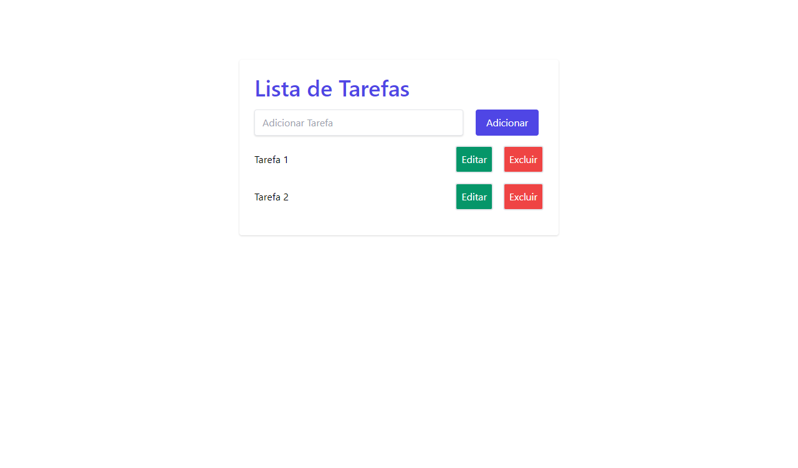

<h2 align="center">
    LISTA DE TAREFAS
</h2>

<h3>Lista de Tarefas - Javascript</h3>

Projeto de Javascript utilizando Tailwind CSS

<h3>Link Github Pages </h3>
<a href="https://barbosacaio.github.io/lista-de-tarefas/" target="_blank">Lista de Tarefas</a>

<h3>Tutorial</h3>

https://www.makeuseof.com/how-to-build-todo-list-app-using-javascript/

<h3>Preview</h3>
